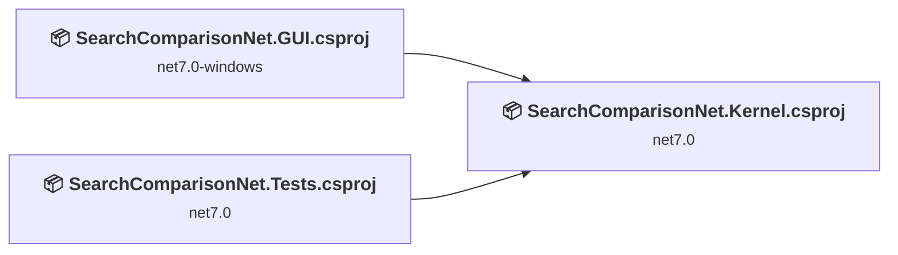
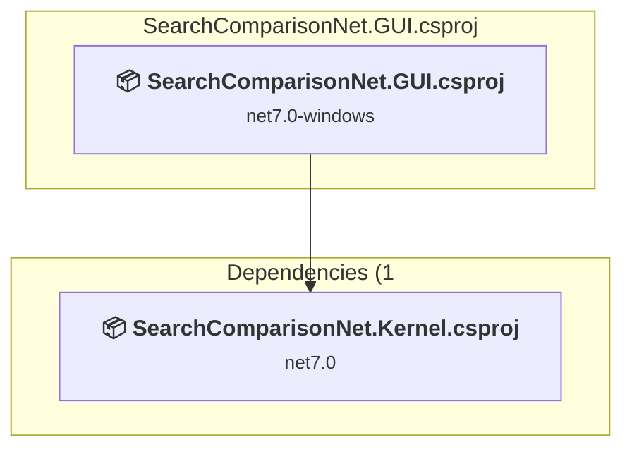
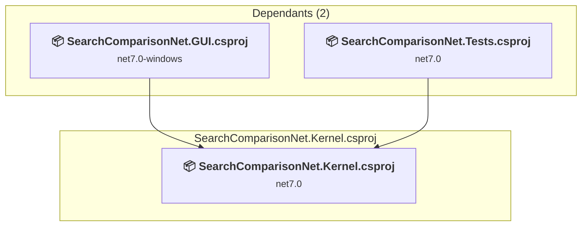
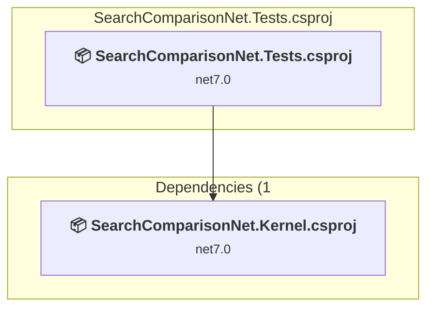

# Projects and dependencies analysis

This document provides a comprehensive overview of the projects and their dependencies in the context of upgrading to .NETCoreApp,Version=v10.0.

## Table of Contents

- [Executive Summary](#executive-Summary)
  - [Highlevel Metrics](#highlevel-metrics)
  - [Projects Compatibility](#projects-compatibility)
  - [Package Compatibility](#package-compatibility)
  - [API Compatibility](#api-compatibility)
  - [Binding Redirect Configuration](#binding-redirect-configuration)
- [Aggregate NuGet packages details](#aggregate-nuget-packages-details)
- [Top API Migration Challenges](#top-api-migration-challenges)
  - [Technologies and Features](#technologies-and-features)
  - [Most Frequent API Issues](#most-frequent-api-issues)
- [Projects Relationship Graph](#projects-relationship-graph)
- [Project Details](#project-details)

  - [SearchComparisonNet.GUI\SearchComparisonNet.GUI.csproj](#searchcomparisonnetguisearchcomparisonnetguicsproj)
  - [SearchComparisonNet.Kernel\SearchComparisonNet.Kernel.csproj](#searchcomparisonnetkernelsearchcomparisonnetkernelcsproj)
  - [SearchComparisonNet.Tests\SearchComparisonNet.Tests.csproj](#searchcomparisonnettestssearchcomparisonnettestscsproj)

## Executive Summary

### Highlevel Metrics

| Metric | Count | Status |
| :--- | :---: | :--- |
| Total Projects | 3 | All require upgrade |
| Total NuGet Packages | 7 | 2 need upgrade |
| Total Code Files | 31 |  |
| Total Code Files with Incidents | 21 |  |
| Total Lines of Code | 1067 |  |
| Total Number of Issues | 107 |  |
| Estimated LOC to modify | 102+ | at least 9.6% of codebase |

### Projects Compatibility

| Project | Target Framework | Difficulty | Package Issues | API Issues | Binding Issues | Est. LOC Impact | Description |
| :--- | :---: | :---: | :---: | :---: | :---: | :---: | :--- |
| [SearchComparisonNet.GUI\SearchComparisonNet.GUI.csproj](#searchcomparisonnetguisearchcomparisonnetguicsproj) | net7.0-windows | 🟡 Medium | 1 | 102 | 0 | 102+ | Wpf, Sdk Style = True |
| [SearchComparisonNet.Kernel\SearchComparisonNet.Kernel.csproj](#searchcomparisonnetkernelsearchcomparisonnetkernelcsproj) | net7.0 | 🟢 Low | 0 | 0 | 0 |  | ClassLibrary, Sdk Style = True |
| [SearchComparisonNet.Tests\SearchComparisonNet.Tests.csproj](#searchcomparisonnettestssearchcomparisonnettestscsproj) | net7.0 | 🟢 Low | 1 | 0 | 0 |  | DotNetCoreApp, Sdk Style = True |

### Package Compatibility

| Status | Count | Percentage |
| :--- | :---: | :---: |
| ✅ Compatible | 5 | 71.4% |
| ⚠️ Incompatible | 1 | 14.3% |
| 🔄 Upgrade Recommended | 1 | 14.3% |
| ***Total NuGet Packages*** | ***7*** | ***100%*** |

### API Compatibility

| Category | Count | Impact |
| :--- | :---: | :--- |
| 🔴 Binary Incompatible | 88 | High - Require code changes |
| 🟡 Source Incompatible | 0 | Medium - Needs re-compilation and potential conflicting API error fixing |
| 🔵 Behavioral change | 14 | Low - Behavioral changes that may require testing at runtime |
| ✅ Compatible | 1301 |  |
| ***Total APIs Analyzed*** | ***1403*** |  |

## Aggregate NuGet packages details

| Package | Current Version | Suggested Version | Projects | Description |
| :--- | :---: | :---: | :--- | :--- |
| CommunityToolkit.Mvvm | 8.2.2 |  | [SearchComparisonNet.GUI.csproj](#searchcomparisonnetguisearchcomparisonnetguicsproj) | ✅Compatible |
| FluentValidation | 11.8.0 |  | [SearchComparisonNet.GUI.csproj](#searchcomparisonnetguisearchcomparisonnetguicsproj) [SearchComparisonNet.Kernel.csproj](#searchcomparisonnetkernelsearchcomparisonnetkernelcsproj) | ✅Compatible |
| Microsoft.Extensions.DependencyInjection | 7.0.0 | 10.0.9 | [SearchComparisonNet.GUI.csproj](#searchcomparisonnetguisearchcomparisonnetguicsproj) | NuGet package upgrade is recommended |
| Microsoft.NET.Test.Sdk | 17.7.2 |  | [SearchComparisonNet.Tests.csproj](#searchcomparisonnettestssearchcomparisonnettestscsproj) | ✅Compatible |
| NuGet.Configuration | 6.7.0 |  | [SearchComparisonNet.GUI.csproj](#searchcomparisonnetguisearchcomparisonnetguicsproj) | ✅Compatible |
| xunit | 2.6.1 |  | [SearchComparisonNet.Tests.csproj](#searchcomparisonnettestssearchcomparisonnettestscsproj) | ⚠️NuGet package is deprecated |
| xunit.runner.visualstudio | 2.5.3 |  | [SearchComparisonNet.Tests.csproj](#searchcomparisonnettestssearchcomparisonnettestscsproj) | ✅Compatible |

## Top API Migration Challenges

### Technologies and Features

| Technology | Issues | Percentage | Migration Path |
| :--- | :---: | :---: | :--- |
| WPF (Windows Presentation Foundation) | 28 | 27.5% | WPF APIs for building Windows desktop applications with XAML-based UI that are available in .NET on Windows. WPF provides rich desktop UI capabilities with data binding and styling. Enable Windows Desktop support: Option 1 (Recommended): Target net9.0-windows; Option 2: Add <UseWindowsDesktop>true</UseWindowsDesktop>. |

### Most Frequent API Issues

| API | Count | Percentage | Category |
| :--- | :---: | :---: | :--- |
| T:System.Windows.Visibility | 21 | 20.6% | Binary Incompatible |
| M:System.Windows.Controls.UserControl.#ctor | 10 | 9.8% | Binary Incompatible |
| T:System.Windows.Application | 8 | 7.8% | Binary Incompatible |
| M:System.Windows.Application.LoadComponent(System.Object,System.Uri) | 7 | 6.9% | Binary Incompatible |
| T:System.Uri | 7 | 6.9% | Behavioral Change |
| M:System.Uri.#ctor(System.String,System.UriKind) | 7 | 6.9% | Behavioral Change |
| T:System.Windows.Markup.IComponentConnector | 6 | 5.9% | Binary Incompatible |
| T:System.Windows.Controls.UserControl | 5 | 4.9% | Binary Incompatible |
| F:System.Windows.Visibility.Hidden | 4 | 3.9% | Binary Incompatible |
| T:System.Windows.RoutedEventHandler | 4 | 3.9% | Binary Incompatible |
| E:System.Windows.FrameworkElement.Loaded | 2 | 2.0% | Binary Incompatible |
| M:System.Windows.Window.#ctor | 2 | 2.0% | Binary Incompatible |
| M:System.Windows.Markup.MarkupExtension.#ctor | 2 | 2.0% | Binary Incompatible |
| T:System.Windows.Data.IValueConverter | 2 | 2.0% | Binary Incompatible |
| T:System.Windows.StartupEventHandler | 2 | 2.0% | Binary Incompatible |
| M:System.Windows.Application.#ctor | 2 | 2.0% | Binary Incompatible |
| M:System.Windows.Markup.InternalTypeHelper.#ctor | 1 | 1.0% | Binary Incompatible |
| T:System.Windows.Markup.InternalTypeHelper | 1 | 1.0% | Binary Incompatible |
| F:System.Windows.Visibility.Visible | 1 | 1.0% | Binary Incompatible |
| T:System.Windows.RoutedEventArgs | 1 | 1.0% | Binary Incompatible |
| P:System.Windows.FrameworkElement.DataContext | 1 | 1.0% | Binary Incompatible |
| T:System.Windows.Window | 1 | 1.0% | Binary Incompatible |
| T:System.Windows.Markup.MarkupExtension | 1 | 1.0% | Binary Incompatible |
| M:System.Windows.Application.Run | 1 | 1.0% | Binary Incompatible |
| E:System.Windows.Application.Startup | 1 | 1.0% | Binary Incompatible |
| T:System.Windows.StartupEventArgs | 1 | 1.0% | Binary Incompatible |
| M:System.Windows.Window.Show | 1 | 1.0% | Binary Incompatible |

## Projects Relationship Graph

Legend:
📦 SDK-style project
⚙️ Classic project

## Project Details

### SearchComparisonNet.GUI\SearchComparisonNet.GUI.csproj

#### Project Info

- **Current Target Framework:** net7.0-windows
- **Proposed Target Framework:** net10.0-windows
- **SDK-style**: True
- **Project Kind:** Wpf
- **Dependencies**: 1
- **Dependants**: 0
- **Number of Files**: 14
- **Number of Files with Incidents**: 19
- **Lines of Code**: 657
- **Estimated LOC to modify**: 102+ (at least 15.5% of the project)

#### Dependency Graph

Legend:
📦 SDK-style project
⚙️ Classic project

### API Compatibility

| Category | Count | Impact |
| :--- | :---: | :--- |
| 🔴 Binary Incompatible | 88 | High - Require code changes |
| 🟡 Source Incompatible | 0 | Medium - Needs re-compilation and potential conflicting API error fixing |
| 🔵 Behavioral change | 14 | Low - Behavioral changes that may require testing at runtime |
| ✅ Compatible | 873 |  |
| ***Total APIs Analyzed*** | ***975*** |  |

#### Project Technologies and Features

| Technology | Issues | Percentage | Migration Path |
| :--- | :---: | :---: | :--- |
| WPF (Windows Presentation Foundation) | 28 | 27.5% | WPF APIs for building Windows desktop applications with XAML-based UI that are available in .NET on Windows. WPF provides rich desktop UI capabilities with data binding and styling. Enable Windows Desktop support: Option 1 (Recommended): Target net9.0-windows; Option 2: Add <UseWindowsDesktop>true</UseWindowsDesktop>. |

### SearchComparisonNet.Kernel\SearchComparisonNet.Kernel.csproj

#### Project Info

- **Current Target Framework:** net7.0
- **Proposed Target Framework:** net10.0
- **SDK-style**: True
- **Project Kind:** ClassLibrary
- **Dependencies**: 0
- **Dependants**: 2
- **Number of Files**: 14
- **Number of Files with Incidents**: 1
- **Lines of Code**: 342
- **Estimated LOC to modify**: 0+ (at least 0.0% of the project)

#### Dependency Graph

Legend:
📦 SDK-style project
⚙️ Classic project

### API Compatibility

| Category | Count | Impact |
| :--- | :---: | :--- |
| 🔴 Binary Incompatible | 0 | High - Require code changes |
| 🟡 Source Incompatible | 0 | Medium - Needs re-compilation and potential conflicting API error fixing |
| 🔵 Behavioral change | 0 | Low - Behavioral changes that may require testing at runtime |
| ✅ Compatible | 298 |  |
| ***Total APIs Analyzed*** | ***298*** |  |

### SearchComparisonNet.Tests\SearchComparisonNet.Tests.csproj

#### Project Info

- **Current Target Framework:** net7.0
- **Proposed Target Framework:** net10.0
- **SDK-style**: True
- **Project Kind:** DotNetCoreApp
- **Dependencies**: 1
- **Dependants**: 0
- **Number of Files**: 6
- **Number of Files with Incidents**: 1
- **Lines of Code**: 68
- **Estimated LOC to modify**: 0+ (at least 0.0% of the project)

#### Dependency Graph

Legend:
📦 SDK-style project
⚙️ Classic project

### API Compatibility

| Category | Count | Impact |
| :--- | :---: | :--- |
| 🔴 Binary Incompatible | 0 | High - Require code changes |
| 🟡 Source Incompatible | 0 | Medium - Needs re-compilation and potential conflicting API error fixing |
| 🔵 Behavioral change | 0 | Low - Behavioral changes that may require testing at runtime |
| ✅ Compatible | 130 |  |
| ***Total APIs Analyzed*** | ***130*** |  |

